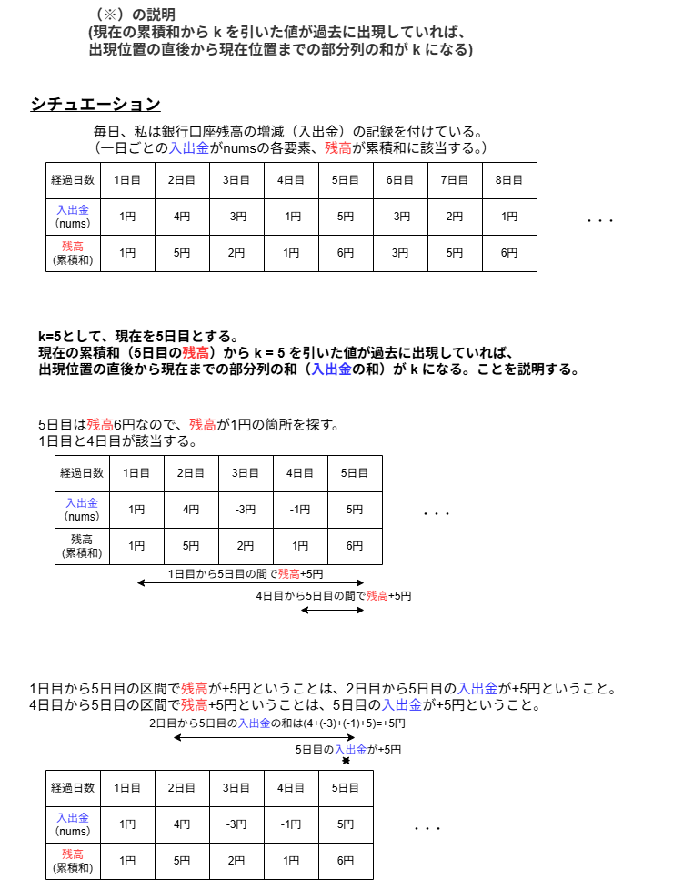

## 問題へのリンク
https://leetcode.com/problems/subarray-sum-equals-k/description/

## 進め方

- 自分で考える。書く前に時間計算量を見積もる(https://github.com/Yuto729/LeetCode_arai60/pull/16#discussion_r2602118324)。
- エラーをはかずに3回解くようになるまで書いてみる。
- 他の人のコードを見て、自分のコードと比較して修正する。

## 自分で考える

### 考え方
総当たりしか思いつかない。

**実行時間**
`nums`の長さを`N`とすると、`nums`へのメモリアクセスは`O(N²)`回になる。
`N`が最大で`2×10^4`なので、アクセス回数は`10^8`程度になる。
Python の実行速度をおおよそ`10^7` ステップ／秒と見積もると、処理には数十秒かかる。

```py
class Solution:
    def subarraySum(self, nums: List[int], k: int) -> int:
        count = 0
        for i in range(len(nums)):
            total = 0
            for j in range(i, len(nums)):
                total += nums[j]
                if total == k:
                    count += 1

        return count
```

# 他の人のコードを見る。

1) 累積和を用いた解法
- 見た解答すべてで累積和で解いていた。
- https://github.com/MasukagamiHinata/Arai60/pull/14/changes
- https://github.com/Kazuuuuuuu-u/arai60/pull/19/changes
- https://discord.com/channels/1084280443945353267/1478763507963924522/1485184369059561643
- https://github.com/tNita/arai60/pull/16/changes
- コメントをざっとみると理解が大変そう。たしかに、累積和を使うといわれてもあんまりピンとこない。いろいろ説明があってありがたい。
- お金で考えると急にイメージできたのでそれで考える。例を図で説明したほうが分かりやすいので、図を付ける。
- 実際の仕事のときも、図を補足資料として添えたほうがいいと思う。

**解きかた**
- `nums`の各要素に対して以下を行う。
 - その時点までの累積和を計算する。
 - 現在の累積和から k を引いた値が過去に出現していれば、出現位置の直後から現在位置までの部分列の和が k になるため（※）、その出現回数分だけSubarrayとしてカウントする。
 - 各累積和の出現回数をカウントする。

（※）については例を載せておく（subarraySum_logic.pngを参照）。

**実行時間**
`nums`の長さを`N`とすると、`nums`へのメモリアクセスは`O(N)`回になる。
`N`が最大で`2×10^4`なので、アクセス回数は`10^4`程度になる。
Python の実行速度をおおよそ`10^7` ステップ／秒と見積もると、処理には数ミリ秒かかる。

```py
class Solution:
    def subarraySum(self, nums: List[int], k: int) -> int:
        subarray_count = 0
        cumulative_sum = 0
        cumulative_sum_to_frequency = defaultdict(int)

        # cumulative sum of an empty list
        cumulative_sum_to_frequency[0] += 1
        for num in nums:
            cumulative_sum += num
            # See subarraySum_logic.png for explanation of why this logic works
            if cumulative_sum - k in cumulative_sum_to_frequency:
                subarray_count += cumulative_sum_to_frequency[cumulative_sum - k]
            cumulative_sum_to_frequency[cumulative_sum] += 1
        
        return subarray_count
```

#### subarraySum_logic.png

