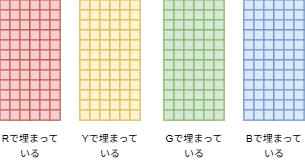
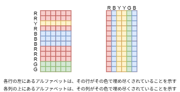
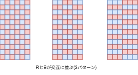
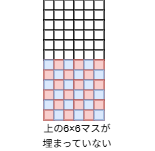

## 野田さんからのfollow up questionに解答していく。

1) 単体テストケースを考えてみてください。
2) ぷよを盤面から消す処理を書いてみてください。消えたぷよより上に存在していたぷよが落ちてくる点に注意してください。
3) ぷよの削除を高速化する方法を考えてください。ビット演算で高速化できますか？ (<- 私はやり方を忘れました。川中さんが知っていると思います。)

- 問題についてはmemo.mdを参照してください。

## 単体テストケースを考える

- まず、定義を確認する
  - https://en.wikipedia.org/wiki/Unit_testing
    - Unit testing, a.k.a. component or module testing, is a form of software testing by which isolated source code is tested to validate expected behavior.
    - a test case is a specification of the inputs, execution conditions, testing procedure, and expected results that define a single test to be executed to achieve a particular software testing objective, such as to exercise a particular program path or to verify compliance with a specific requirement.

- テストケースは、入力と期待する出力、実行条件(どのOS、どのインタプリタで動かすなど？)、テスト手順が必要。

### 入力と期待する出力について考える

- 大まかな方針は、3つ
  - (A)ちゃんと検出してほしいパターン
    - 上下左右を隣接してカウントし、4つ以上ならカウントすること
  - (B)検出をしてほしくないパターン
    - 斜めを隣接としてカウントしないパターン
  - (C)入力が意図しないものであるときのパターン
    - 空リストを意図通りに扱う、など

#### (A) ちゃんと検出してほしいパターン
- 極端な例と、ベーシック(?)な例を用意するかな。
- 極端な例：

- 全部が一色で埋まっているケース(Rで埋まっている、Yで埋まっている、Gで埋まっている、Bで埋まっている)

  - 出力は "1"

- 縦一列、横一列が埋まっているケース

  - 出力は、左図が"6",右図が"5"

- ベーシックな例
  - 4ちょうどがあったら、検出するケース。何個か用意。これは、(B)のベーシックな例と組み合わせて作る。

  - 5個、6個あったら、検出するケース。何個か用意。これは、(B)のベーシックな例と組み合わせて作る。

#### (B) 検出をしてほしくないパターン
- 斜めを隣接としてカウントしないことをチェックするために、2色が交互に出現パターンを用意

  - 上記の3パターンとも出力は"0" 

  - ベーシックな例
    - 隣接が2つや3つのときに、検出しないケース。何個か用意。これは、(A)のベーシックな例と組み合わせて作る。

#### (C) 入力が意図しないものであるときのパターン
- 縦12列、横6列が守られていない場合は、例外をだす。
- "R", "Y", "G", "B"以外の値が入っている場合は、、、どうしよう。これを検出するのは、プログラムの処理に入ってからだが、いちいち止まられたら、困るのか？
- これをぷよぷよだとしたとき、"R", "Y", "G", "B"以外の任意の文字(列)を"ぷよが埋まっていない場所"とすればよさそう。
- こうすると、memo.mdにあげたコードが、テストに失敗する(この何も埋まっていない場所が4つあると「消える場所である」と誤検出するため)、それは後で修正するとして、これもテストケースにいれる。

- 今回のテストケースとして、ぷよぷよ盤の上のほうが、何も埋まっていないケースだけチェックする。隙間が埋まっていないケースは次の問題(ぷよを盤面から消す処理を書く)の範囲の話に見えるため、テストケースに入れない。

**実装方法**
- 今回、縦12、横6の盤だが、これが将来変わることは想像できるので、それが変わってもテストができるようなコードにする。
  - ベーシックなケースは固定値を入れないと難しそう。それ以外なら、対応できそう。
- ぷよの色は、、、変わらない？

## 実装したコード
- 後日対応
- 自力では難しそうなので、LLMの助けを借りて考えてみる。

## 実行条件(どのOS、どのインタプリタで動かすなど？)

## テスト手順
