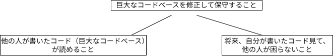
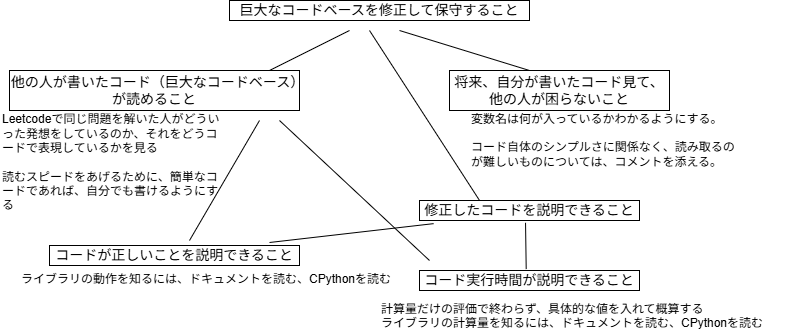
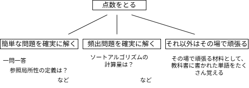

# ソフトウェアエンジニアとして働くための第一歩として、練習会に参加しました。
現在、情報系の研究職に就いていますが、研究者からソフトウェアエンジニアへ転身しようと考えました。その第一歩として、この練習会に参加しました。

ソフトウェアエンジニアとして仕事ができるようになることを目標に、私が練習会でどのように取り組んだのかについて書きたいと思います。また、分かったこと、つまづいたところ、重要だと思ったことについて雑多に書きたいと思います。これから参加する方や、すでに参加している方が、この練習会をより有効に活用するきっかけになれば幸いです。


## 練習会に参加したきっかけ
情報科学の博士課程を修了した後、情報系の研究職に就きました。研究では分散システムを扱っており、より現実的な制約のもとでシステムを設計する仕事に携わりたいと考えて入社しました。

しかし、勤務先は情報システムを主力事業とする企業ではなく、研究活動を継続することは次第に難しくなりました。論文執筆が業務の中心でもないため、少なくとも現在の環境で研究者としてキャリアを続けることは難しいと考えました。

そこで、研究者として新たな環境へ進むか、以前から興味のあったソフトウェアエンジニアへ転身するかを考え、後者を選ぶことにしました。

しかし、ソフトウェアエンジニアになるには何をすればよいのか分からないという悩みがありました。プログラミングコンテストに参加したり、コンピュータサイエンスの本を片っ端から読んで知識を身に付けたりするだけでは、ソフトウェアエンジニアとして仕事ができるようにはならないのではないか、と感じていました。

そんな中、以前に[エンジニアの育成に言及している記事](https://nuc.hatenadiary.org/entry/2021/03/31)を読んだことを思い出しました。数年ぶりに調べてみると、コーディング練習会を開催していることを知りました。さらに、[関連記事](https://nuc.hatenadiary.org/entry/2025/11/29/)を読んで、この練習会ではソフトウェアエンジニアとして仕事をする上で役立つことを学べそうだと感じ、参加することにしました。


## 練習会での取り組み方
どうすればソフトウェアエンジニアとして仕事ができるようになるのかを考えながら取り組んでいました。

まず行ったのは、ソフトウェアエンジニアに求められる仕事のイメージを具体化して、必要な能力を知ることです。そのために、Discordやコメント集を読み漁りました。その結果、ひとまず以下のように整理しました。



Discordやコメント集は、何となく言いたいことは分かるものの、十分には理解できないコメントがたくさんありました。そのようなものは、「今は理解できなくても、練習を続ければそのうち分かるだろう」と考え、一旦保留にしました。そして、この練習会を通して、この知識体系をいかに豊富にしていくかを考えることにしました。具体的には、以下のことを繰り返しました。

```text
  ・練習会で示されている「標準的な進め方」に沿って問題を解く。 
  ・自分のコードについたコメントや他の参加者の書いたコードについたコメントを読み、新しく知ったことを知識体系へ追加する。
  ・一問解くたびにDiscordやコメント集を読み返し、それまで理解できなかった内容が理解できるようになっていないかを確認する。新たな気付きがあれば、それも知識体系へ追加する。
```

イメージとしては、次の図のように知識体系を少しずつ育てていく感覚でした。



## コードが読めるようになるとはどういうことなのか
最初にコメント集を読んだとき、「コードが読めるようになること」が最も重要だというコメントを目にして、確かにそうかもしれないといいう感想を抱きました。しかし、「読める」とは具体的にどういう状態なのかは分かっておらず、自分なりの答えが見えてきたのは40問ほど解いた頃でした。

最終的に、コメント集にある次のコメントの通りだなと感じました。

> 自分が読むときの許容度は広く、書く時は自分なりの統一した狭い幅に収めるという非対称性も必要になるでしょう。スタイルガイドを強制することは普通はできないので、かなり広く読めるようにして、ただし、自分のこだわりはもっておくということが必要になります。

そして、許容度を最も広く考えると、「自然言語で表現したいこととコードの表現が一致していること」なのではないか、と考えるようになりました。

今後考え方が変わる可能性はありますが、現時点ではこの理解に納得しています。この考えに至ってからは、コードを読むことをこれまで以上に意識し、他の参加者のコードを積極的に読むようになりました。

読めるようになることの重要性を実感するまでには、随分と時間がかかりました。振り返ると、根本的な問題は「問題の解き方」がおかしな方向へ進んでいたことだったのだと思います。

分からない問題があったとき、私は解答を見てコードの動作を理解し、滑らかに書けるまで練習していました。しかし、問題を解けるようになるためには、「手作業で解けるようになること（コメント集で発想法に該当する部分です）」と、「その手順をコードへ落とし込めるようになること」という二段階のプロセスが必要だったのだと思います。当時の私は前者をほとんど意識せず、後者ばかりを練習していました。その結果、「初見の問題をどう解けばよいのか」という感覚は身に付きませんでした。

実は、練習会を始めたばかりの頃は、この二段階のプロセスを自然に分けて考えられていました。当時はコードの書き方をほとんど忘れていたため、まず発想を考え、その後に解答を見てコードへの落とし込み方を確認していました。しかし、少しコードが書けるようになると、「書けるはずだ」という意識が先に立ち、発想を整理する前にコードを書き始めてしまうようになっていました。その結果、途中で行き詰まることが増えていきました。

この状況が改善したのは、動的計画法の問題を解いていた頃でした（30問過ぎたころです）。どうしても解けず、コメント集を読んでいたところ、「とにかく簡単な例を書いてみる」という趣旨のコメントを見つけました。それをきっかけに、簡単な例や図を書き、まずは手作業で解くことを徹底するようになりました。また、コードも紙に書きだし、図と照らし合わせながら考えるようにしました。すると、問題の考え方が整理され、コードも安定して書けるようになりました。また、分からない箇所がどこなのかも明確になり、自分に足りなかった考え方や、手作業で解くために必要な発想も認識できるようになりました。

それと同時に、コードを読むことに対する考え方も変わりました。同じ問題であっても、手作業での考え方は人それぞれです。そして、同じ考え方であっても、コードの表現は人によって異なります。そのため、読むときには広い許容度が必要であり、「自然言語でやりたいこととコードの表現が一致しているか」という観点で読むことが重要なのだと理解できました。

ちょうどその頃に二分探索のセクションへ入り、この考え方を意識しながら他の参加者のコードを読むことで、「コードを読める」ということがどういうことなのか、自分なりに分かってきた気がします。


## コメントするときに意識していること
コメントを書くことは、この練習会の中でも特に難しいと感じました。

まず意識したのは、書いたコメントが、コードをより良くするためのものになっているかを考えることです。特に気を付けたことは、自分の知識を披露することを目的としないことです。

他に意識したこととしては、コメント集にあった[「私の知っている正解を述べられるか」という質問をしない](https://github.com/Ryotaro25/leetcode_first60/pull/43#discussion_r1863271069)ということです。当時の私は、仕事でこのような質問を何度もしていました。しかし、このような質問では、仕事は良い方向へ進みません。その指摘を読んでからは、相手の意図を確認することや、提案を伝えることを意識するようになりました。

もう一つ学んだのは、自分の考えを明確に伝えることです。なぜそのコメントを書いたのか、どのような理由でその提案をしているのかを一緒に伝えなければ、相手には意図が伝わりません。この点について指摘を受けてから講師陣のコメントを読み返してみると、どのコメントにも「なぜそう考えたのか」という理由まで丁寧に書かれており、とても納得しました。


## プログラミングコンテストの記事についての解釈
本筋とは少し外れますが、[この記事](https://nuc.hatenadiary.org/entry/2021/03/31#%E7%AB%B6%E6%8A%80%E3%83%97%E3%83%AD%E3%82%B0%E3%83%A9%E3%83%9F%E3%83%B3%E3%82%B0)についての私なりの解釈を書いておこうと思います。なお、私はプログラミングコンテストに参加したことはありません。

私なりの理解を一言で表すと、「異なる目的で身に付けた知識や考え方を、そのまま別の目的へ持ち込んではならない」ということです。

例えば、ある問題の正解プログラムを最も早く提出した人を勝者とするプログラミングコンテストがあったとします。そこで勝つためには、提出コードを短くするために、変数名を一文字にする、改行を極力減らすといった工夫が有効かもしれません。しかし、それをソフトウェアエンジニアとして保守・運用するコードにもそのまま適用してしまうと、可読性や保守性を損ない、かえって問題を生むことがあると思います。

また、言語選択についても同じです。もし「インデントを整えるのが大変だからPythonは選ばない」という判断を、コードを一秒でも早く提出することを目的としたプログラミングコンテストの文脈で述べるのであれば、一つの考え方として理解できます。しかし、ソフトウェアエンジニアの仕事における言語選択の理由としてそう言われたら、私は不安を覚えます。

知識は、その目的に応じて整理されるので、どのような目的から生まれたものなのかを考えることが重要だと考えています。

## 大学院受験で身に付けた知識
ここでは、「知識は、その目的に応じて整理される」ということの一例として、大学院受験のときの話を書こうと思います。

私は学部までは情報系ではなく、大学院から情報分野へ進学しました。大学院受験では、受験科目となっていたアルゴリズム、コンピュータアーキテクチャ、計算理論、情報理論、ネットワークなどを半年ほどかけて一通り勉強しましたが、そのときの目的は「試験で点数をとること」でした。そのため、知識はその目的に沿って整理されていました。



大学院では、受験で学んだ分野の研究はしませんでした。また、試験で得点するために身に付けた知識は、日常的に使う場面もありませんでした。その結果、受験で勉強した内容の多くは忘れてしまい、練習会ではほぼ一から学び直すことになりました。


## さいごに
この練習会に参加して、この練習会は本当に貴重な環境だと思います。特に良かったと感じたことは、次の二つです。
**専門家とコミュニケーションを取れること**：何かの専門家になるには、その分野の専門家と継続的にコミュニケーションを取り、自分の考え方や知識を修正していくことが欠かせません。私が大学院で、論文を書き、アカデミアの世界にほんの少しだけ貢献できたのは、指導教員が見捨てずに指導してくださったこと、そして、最初から研究ができた先輩や後輩と日常的にコミュニケーションをとっていたことが大きかったと感じています。

**他の参加者とコミュニケーションを取れること**：今回参加して実感したのは、コードを読む力は、一人で問題を解いているだけではなかなか身に付かないということでした。他の参加者のコードを読み、感情を育てることで、少しずつ読めるようになっていったと感じています。参加者同士でたくさんコミュニケーションをとるのが重要だと思いました。


読んでいただきありがとうございました。コメントなどあればよろしくお願いします。
